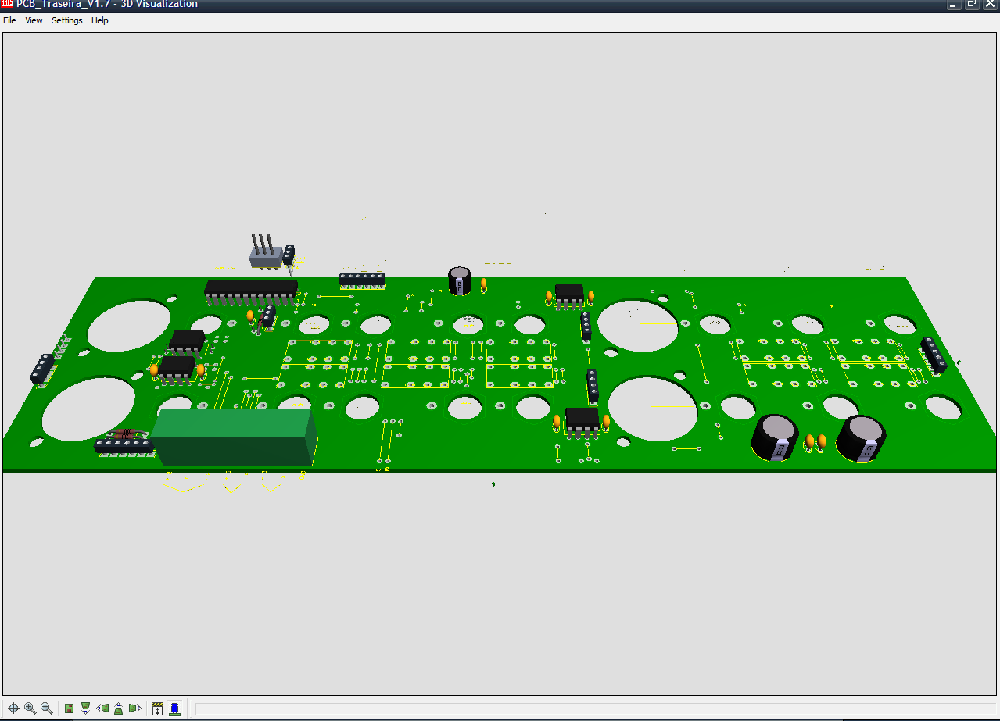
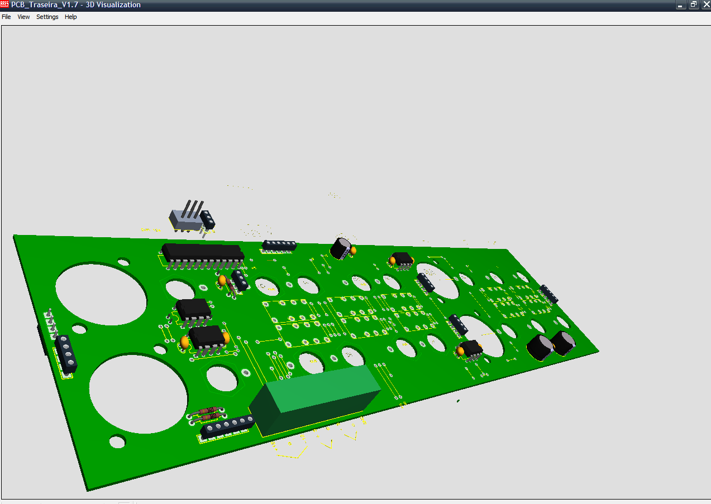

## Synopsis

Digital Pre Amplifier with digital control.  
The audio parameters such as volume, balance, tremble, bass, source, rec source and others  
are controleld by the user using combinations of buttons and potentiometers.  
The potentiometer measure the value that are the gathered by the microprocessor and transformed  
to digital values to been show in the LCD and send to the digital tone contropl circuit.  
The source and rec channels are digital selected and the relays are selected via I2C bus enabling  
to to reduce the antenna effect on the analog signal.
Many inputs can be selected including balanced inputs, REC source can be disabled.  
The system is managed by an microcontroller, the relays by pcf8574 I2C port expanders, for tone  
is used an PGA2310 conteoled by SPI serial protocol.  
All the relevant info is presented in an LCD.  
The user can interchange two cards in slot enabling to add different modules like Phono card, DAC card.  
The phono card enables to select the load to be applied to the cell.  
Future modules will enable RIAA curve selection.  

## Software
The system is developed using AVR-gcc.

## Dependencies
None relevant 

## Videos/Images

Overhall System.  

Rear Board.  

Power Supply.  

Rear Board.  

## Contributors

Main Developer :HSO  
Email: hugo(dot)soares(at)fe(dot)up(dot)pt
